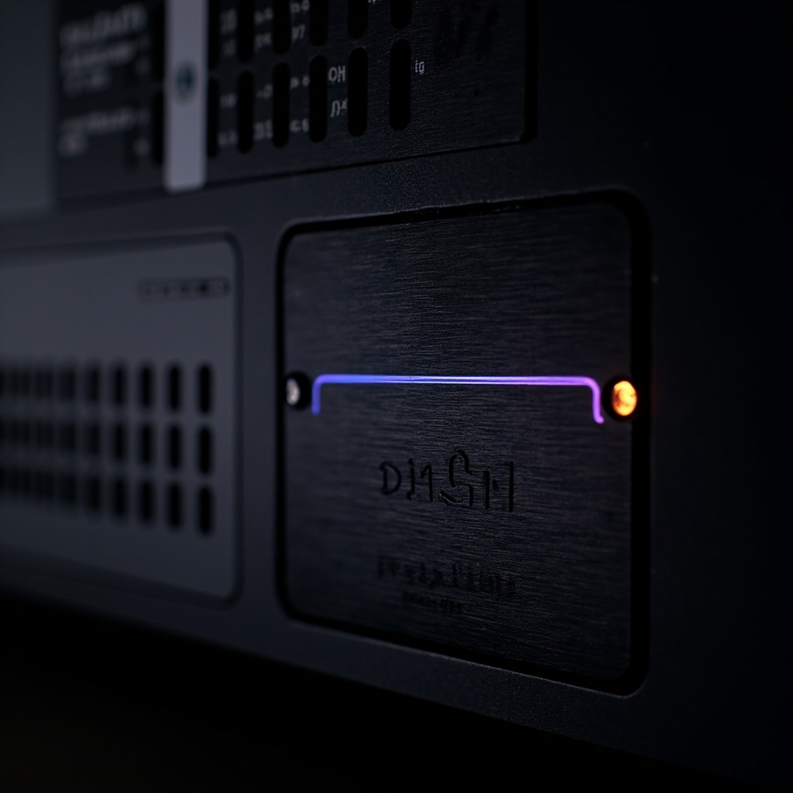

<p align="center">
  
</p>

<h1 align="center">dsh-feishu</h1>
<p align="center">Harness 长在飞书里，不是飞书遥控网页</p>

<p align="center">
  
  
  
  
  
</p>

<p align="center">
  <a href="#中文">中文</a> · <a href="#english">English</a> · <a href="#features">功能</a> · <a href="#who">适合谁</a> · <a href="#install">五分钟</a>
</p>

<p align="center">
  
</p>

---

# 中文

插件市场里 `feishu` / `lark` 已经三十多个。多数是通知器、多 IM 网关，或 `dsh plugin --profile web add` 之后挂在官方网页旁边的桥。飞书只是遥控器：网页还在，关掉浏览器，产品就少了一半。不少还默认你坐在个人 PC 前，终端里弹二维码。

这套是跑在飞书里的 harness，部署面是 **Linux 服务器**。一个 `dsh --profile feishu` 当守护进程常驻，日志进文件，没有要人盯着的 TTY。飞书长连接进、飞书卡片出。模型、斜杠命令、进度、Goal、会话，全部发生在聊天框。没有 3080，没有审批弹窗，没有给本机用的 TUI。

首个 bot 只能在开放平台建好，把 App ID / Secret 写进环境变量再启动。服务器上没处可贴二维码。已经通了的 bot 再开第二个，码可以打回飞书；那是后话，不是第一次上手。

不跟货架比按钮数量。没有打字机答案卡。要比的四件事：

1. **长在飞书里** — harness 的面就是飞书，不是遥控网页
2. **Goal 卡片** — 设定、改目标、暂停、恢复、清除，点卡片就能做；重启不偷着续
3. **一进程多 bot** — 2～3 个飞书身份共用一套 Agent，同一条 session 不能两头同时握
4. **会变的进度头** — `[dsf-23% G1/3] Using bash...(2)`，不是「正在思考…」四个字一直挂着

GitHub 上另有一个 [`PGZXB/dsh-feishu`](https://github.com/PGZXB/dsh-feishu)，飞书控制台 + 卡内审批，官方 Web 还在。owner 不同，产品也不同。

<a id="features"></a>
## 卖点

### 完全不依赖 Web

不装 `dsh-web-app`，不开 3080，不跑 headless 一次性进程。Cordis 插件直接 `create` / `followup` / `steer` / `cancel` / `resume`。飞书是面，不是壳外面再套的壳。

### Goal：一张卡片管到底

发 `/goal`，或直接在卡片里填目标点「设定并开始」。句末可写「最多跑 3 轮」。

Agent 自己多轮推进。进程重启后 **不会** 偷偷接着烧，要在卡片上点「恢复自动续跑」，或发 `/goal resume`。

卡片上能做的事：

- 设定 / 修改目标（卡内表单）
- 暂停 / 恢复自动续跑
- 清除当前目标
- 完成变绿、阻塞变红，原地改，不另刷一堆纯文字

斜杠命令仍然全部可用。先到的算数。

### 会变的进度头

进度卡片原地改：

```
[dsf-23% G1/3] Using bash...(2)
```

模型别名、上下文占比、Goal 轮次（快到上限标 near）。跑完变 Done，失败变 Failed，正文另发一条，不跟进度糊在一起。

### 一进程多 Bot

同一个进程挂 2～3 个独立飞书应用。会话按 `(appId, chat_id)` 分开。历史可以互相 `/resume`，同一条 session 不能被两个窗口同时握住。

### 斜杠命令就在聊天框

`/stop` `/clear` `/model` `/status` `/compact` `/resume` `/rename` `/goal` `/bye`

不支持的 `/` 会直接告诉你本期有哪些。完整表见 [docs/handbook.md](docs/handbook.md)。

### 高危审核卡 / 提问卡

未点名的 `rm`、`find -delete`、破坏性 git 会挂起，飞书出一张橙卡。点「允许这一次」才跑；打字同意不算批准。

需要选择时模型调 `ask_user_question`，出蓝卡。可以点选项，也可以在卡内填空提交，也可以直接打字。先到的算数。开放平台须订 `card.action.trigger`。

### 上下文会自己收

新用户轮开始前，更早的 read / glob / grep / bash 大结果收成占位。glob 自动滤掉 `node_modules` / `.git` / `.pnpm`。可选：生图 / 多步浏览类 MCP 藏到 `enable_mcp` 之后。

### 多模态按飞书的方式走

图 / 语音 / 文件落到本地 inbox，把路径写给模型。**不**把图片塞进 session image block。回图、回文件、回语音走 `send_file`。

<a id="who"></a>
## 适合谁 / 不适合谁

适合：有一台 Linux 服务器，要把 dsh 做成 7×24 云端同事；已经在飞书办公、不想再为 Agent 开网页或守着笔记本终端；同一套 Agent 多个飞书身份；Goal 这种「交代完让它自己盯」，但中断和续跑必须自己说了算。

不适合：个人 PC 上扫码 30 秒上手、还想留官方 Web 控制台、需要打字机流式答案卡、或只把飞书当通知渠道。那些货架上已经很多，去搜 `feishu` 即可。

<a id="install"></a>
## 五分钟跑起来

面向一台已经能出网的 Linux 机器。需要 Node 22 和已安装的 `dsh`（`npm i -g @deepseek-ai/dsh`）。

先在飞书开放平台建一个**企业自建应用**，事件订阅用长连接（WebSocket），不要 webhook。把 App ID / Secret 备好再部署。步骤见 [docs/feishu-setup.md](docs/feishu-setup.md)。

### 从 GitHub 装到独立 profile

```sh
dsh plugin --profile feishu add github:shoxiy-danny/dsh-feishu
```

建议钉扫描过的 commit，和市场页证据对齐：

```sh
dsh plugin --profile feishu add github:shoxiy-danny/dsh-feishu#<sha>
```

然后把 App ID / Secret 和 `DEEPSEEK_API_KEY` 放进环境，再：

```sh
dsh --profile feishu
```

### 从本仓脚本装（开发 / 自托管）

```sh
cp .env.example .env
# 填 FEISHU_APP_ID / FEISHU_APP_SECRET / DEEPSEEK_API_KEY

chmod +x scripts/*.sh scripts/dsh-feishu-cli
./scripts/setup.sh
./scripts/start.sh
```

启动后到这个应用的单聊打一句。应先收到表情，再看到进度头，然后是正文。发 `/goal` 会出一张可点的目标卡。

工作目录默认家目录；附件落 `workspace/inbox/`。第二个 bot 再填 `FEISHU_APP_ID_2` / `FEISHU_APP_SECRET_2`。

## 文档

| 文件 | 内容 |
|------|------|
| [docs/handbook.md](docs/handbook.md) | 斜杠命令、Goal 卡片、模型、多 bot、MCP、假 bot |
| [docs/feishu-setup.md](docs/feishu-setup.md) | 飞书应用、权限、长连接 |
| [docs/publish.md](docs/publish.md) | 作者：GitHub topic 和市场收录 |
| [examples/](examples/) | 模型表、profile overlay 样例 |

默认模型只有 DeepSeek 官方 `dsf` / `dsp`。加自己的供应商见手册「模型」一节。

需要 [DeepSeek Harness](https://github.com/deepseek-ai/deepseek-harness)。发现页：[dsh-plugin.market](https://dsh-plugin.market/)。

---

# English

**The harness lives in Feishu, not a remote for the webpage.**

The plugin market already has thirty-plus `feishu` / `lark` listings. Most are notifiers, multi-IM gateways, or bridges you add with `dsh plugin --profile web add`. Feishu is only a remote: the webpage is still there, and closing the browser takes half the product with it.

This is the harness, running in Feishu, meant for a **Linux server**, not a laptop you scan a terminal QR on. One `dsh --profile feishu` as a daemon. Logs go to a file. Nobody has to watch a TTY. Feishu WebSocket in, Feishu card out. Models, slash commands, progress, Goal, sessions: all in chat. No port 3080. No approval popup. No desktop TUI.

The first bot has to be created on the open platform and dropped into env vars. A headless server has nowhere to put a QR code. Extra bots can later be opened from an already-working chat; that is not how you bootstrap.

We do not compete on button count. No typewriter answer card. Four things instead:

1. **Lives in Feishu** — the harness surface is chat, not a remote for the webpage
2. **Goal card** — set, edit, pause, resume, clear on the card; a restart will not keep burning tokens until you resume
3. **Several bots, one process** — 2–3 Feishu identities, one agent; one session cannot be held by two windows
4. **A progress header that changes** — `[dsf-23% G1/3] Using bash...(2)`, not a frozen "Thinking…"

There is another GitHub repo named [`PGZXB/dsh-feishu`](https://github.com/PGZXB/dsh-feishu): a Feishu console with in-card approvals, official web still on. Different owner, different product.

## Features

### No web dependency

No `dsh-web-app`, no port 3080, no one-shot headless runner. A Cordis plugin calls `create` / `followup` / `steer` / `cancel` / `resume` in-process. Feishu is the surface, not a wrapper around a wrapper.

### Goal: one card, the whole loop

Send `/goal`, or type the objective on the card and tap **Set and start**. You can append "max 3 rounds" at the end.

The agent continues across turns. After a process restart it will **not** keep burning tokens until you tap **Resume** or send `/goal resume`.

On the card: create / edit (form), pause, resume, clear. Complete turns green, blocked turns red. Slash commands still work.

### A progress header that actually changes

The card edits in place:

```
[dsf-23% G1/3] Using bash...(2)
```

Model alias, context %, Goal round (`near` when the cap is close). Done / Failed on the card; the reply is a separate message.

### Several bots, one process

The same process holds 2–3 Feishu apps. Sessions are keyed by `(appId, chat_id)`. History can `/resume` across bots; one session cannot be held by two windows at once.

### Slash commands in the composer

`/stop` `/clear` `/model` `/status` `/compact` `/resume` `/rename` `/goal` `/bye`

Unknown `/` replies with the supported list. Full table: [docs/handbook.md](docs/handbook.md).

### Approval cards / ask-user cards

Unnamed `rm`, `find -delete`, and destructive git pause on an orange card. Tap **Allow once** to run. Typing yes does not approve. Choices go through `ask_user_question` (blue card): tap an option, submit the form, or type a reply. First answer wins. Subscribe to `card.action.trigger` on the open platform.

## Five minutes

Aimed at a Linux box that can reach the internet. Need Node 22 and `dsh` (`npm i -g @deepseek-ai/dsh`).

Create a Feishu **enterprise self-built app** first. Subscribe to events over **WebSocket**, not webhook. Have App ID / Secret ready before you deploy. Details: [docs/feishu-setup.md](docs/feishu-setup.md).

### Install from GitHub

```sh
dsh plugin --profile feishu add github:shoxiy-danny/dsh-feishu
```

Pin a scanned commit if you want the same evidence the market page shows:

```sh
dsh plugin --profile feishu add github:shoxiy-danny/dsh-feishu#<sha>
```

Put `FEISHU_APP_ID` / `FEISHU_APP_SECRET` / `DEEPSEEK_API_KEY` in the environment, then:

```sh
dsh --profile feishu
```

### Install from this repo (dev / self-host)

```sh
cp .env.example .env
# fill FEISHU_APP_ID / FEISHU_APP_SECRET / DEEPSEEK_API_KEY

chmod +x scripts/*.sh scripts/dsh-feishu-cli
./scripts/setup.sh
./scripts/start.sh
```

Then send one message in a p2p chat with that app. You should get a reaction, a progress header, then the reply. `/goal` opens a tappable Goal card.

Default cwd is the home directory; attachments land in `workspace/inbox/`. A second bot is `FEISHU_APP_ID_2` / `FEISHU_APP_SECRET_2`.

## Who this is for / not for

For: you have a Linux server and want dsh as a 24/7 coworker; you already live in Feishu and do not want another Agent webpage or a laptop terminal to babysit; one agent, several Feishu identities; Goal ("leave it running") with pause / resume that you say out loud.

Not for: 30-second QR setup on a personal PC; people who still want the official web console or typewriter streaming cards; or Feishu-as-notifications-only. The market already has those. Search `feishu`.

## Docs

| File | What |
|------|------|
| [docs/handbook.md](docs/handbook.md) | Commands, Goal card, models, multi-bot, MCP, fake CLI bot |
| [docs/feishu-setup.md](docs/feishu-setup.md) | Feishu app, scopes, long connection |
| [docs/publish.md](docs/publish.md) | Author: GitHub topics and market listing |
| [examples/](examples/) | Model table and profile overlay samples |

Ships DeepSeek official aliases only: `dsf` / `dsp`. Extra providers: see the handbook.

Requires [DeepSeek Harness](https://github.com/deepseek-ai/deepseek-harness). Discovery: [dsh-plugin.market](https://dsh-plugin.market/).

MIT. Issues and PRs welcome.
